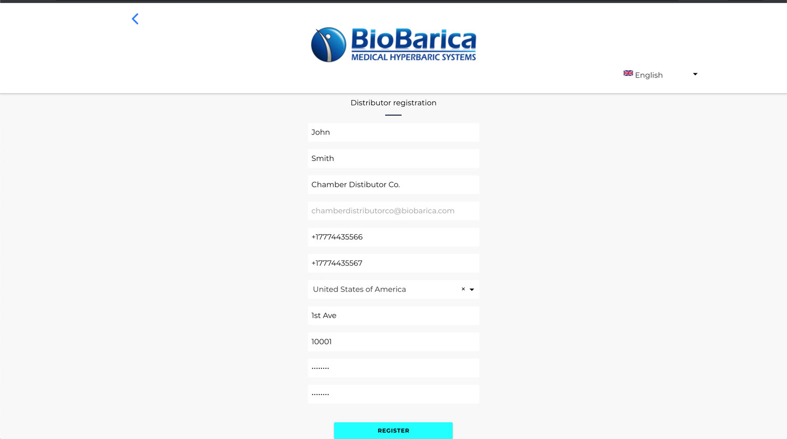

# Registrarse

!> Como distribuidor de BioBarica, se le enviará una invitación a su correo para registrarse. Usted no podrá registrarse a BioBarica Global System sin este enlace de invitación.

## Enlace de Registro

> Usted recibirá por correo un enlace de registro. Si no lo ha recibido, por favor [contáctenos](/es/support)

Una vez que recibió su enlace de registro, haga click en el mismo o acceda a la URL en su correo. Este enlace contiene un token que puede utilizarse una sola vez para registrarse. 

El enlace de registro se verá así:
```
https://pwa.biobarica.com/account/create/distributor?code=FYM7h8qtpWtf77AP3UMW
```

## Formulario de Registro

1. Complete el formulario de registro con los detalles de su empresa.

> Esta información debe ser precisa, ya que estará disponible para usuarios que quieran comprar una cámara, y hará que sea más sencillo para ellos poder contactarse con usted.

2. Haga click en el boton "Registrarse"

!> IMPORTANTE: La contraseña debe contener al menos 8 caracteres con una combinación de mayúsculas, minúsculas y números. Debe guardar esta contraseña, ya que será utilizada para acceder al sistema.

